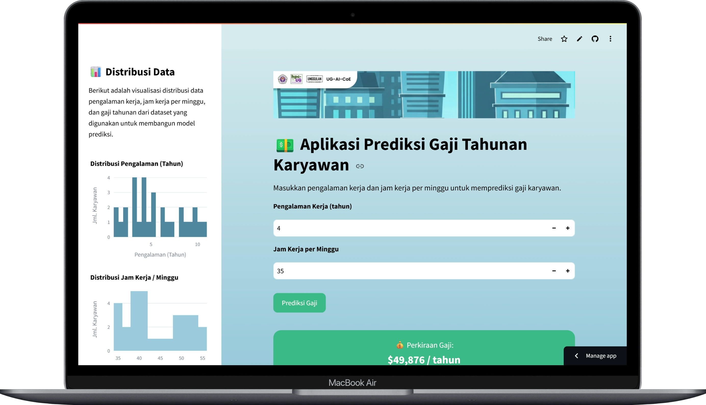

# 💵 Aplikasi Prediksi Gaji Tahunan Karyawan Menggunakan Algoritma Regresi Linier Berbasis Streamlit.

## 🔎 Tentang Proyek
Proyek ini bertujuan untuk memperkenalkan penerapan algoritma/model regresi linier dalam studi kasus berupa prediksi gaji per tahun berdasarkan variabel seperti Pengalaman dan Jam Kerja Per Minggu. Proyek ini dirancang mengikuti metodologi CRISP-DM agar proses pengembangan model dilakukan secara sistematis, terstruktur, dan mudah dievaluasi.

Link Demonstrasi:
https://salarypredictordgx.streamlit.app/
  
## 📦 Dependensi
|  Nama  |  Versi  |
|--------|-----------|
|[streamlit](https://pypi.org/project/streamlit/)|1.36.0|
|[pandas](https://pypi.org/project/pandas/)|2.2.2|
|[joblib](https://pypi.org/project/joblib/)|1.4.2|
|[scipy](https://pypi.org/project/scipy/)|1.11.4|
|[plotly](https://pypi.org/project/plotly/)|5.22.0|
|[numpy](https://pypi.org/project/numpy/)|1.26.4|
|[scikit-learn](https://pypi.org/project/scikit-learn/)|1.4.2|

## 🖥️ Kebutuhan Sistem
* Sistem Operasi (OS): Windows 10, Mac, Linux.
* Web Browser: Google Chrome, Microsoft Edge, Firefox, Safari.

## 🥼 Dibuat oleh
* Wicaksono Hanif Supriyanto
* Muhammad Riza Jamalul Akbar
* Zahwa Annisa Hendajani

## 📚 Referensi
* Allena Venkata Sai Abhishek. Salary Dataset – Simple Linear Regression. Kaggle. https://www.kaggle.com/datasets/abhishek14398/salary-dataset-simple-linear-regression

